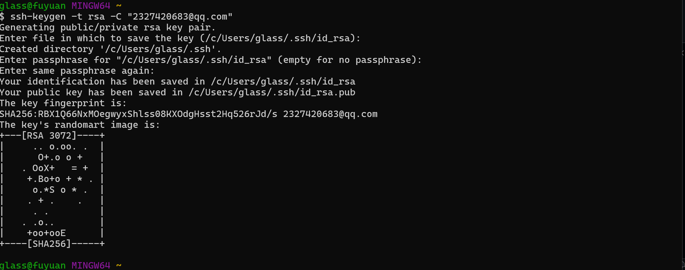
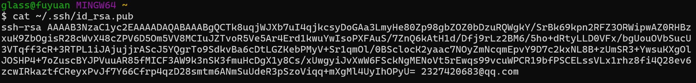
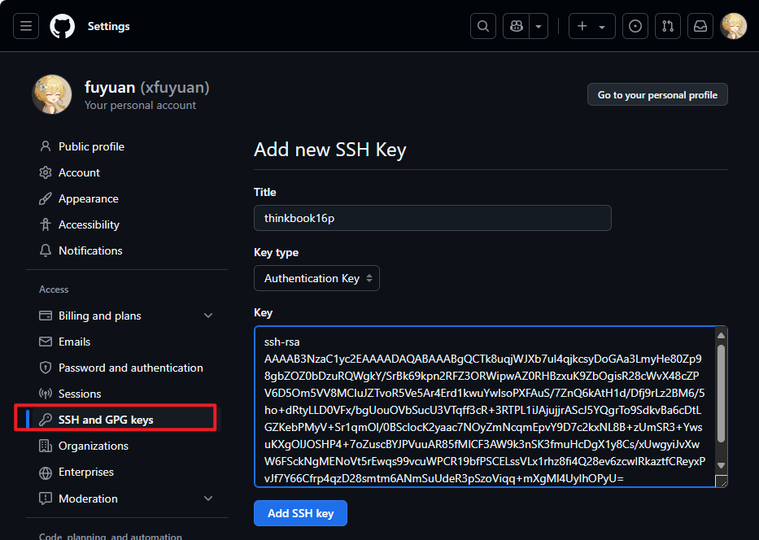
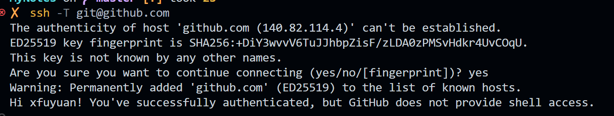

# 为Github账户设置SSH keys

众所周知ssh key是加密传输。

加密传输的算法有好多，git使用rsa，rsa要解决的一个核心问题是，如何使用一对特定的数字，使其中一个数字可以用来加密，而另外一个数字可以用来解密。这两个数字就是你在使用git和github的时候所遇到的public key也就是公钥以及private key私钥。

其中，公钥就是那个用来加密的数字，这也就是为什么你在本机生成了公钥之后，要上传到github的原因。从github发回来的，用那公钥加密过的数据，可以用你本地的私钥来还原。

如果你的key丢失了，不管是公钥还是私钥，丢失一个都不能用了，解决方法也很简单，重新再生成一次，然后在[github.com](https://github.com)里再设置一次就行。

## 1. 生成 SSH key

首先检查是否已生成密钥 cd ~/.ssh，ls如果有2个文件，则密钥已经生成，id_rsa.pub就是公钥，没有则直接生成

> ssh-keygen -t rsa -C "2327420683@qq.com"

然后依照提示进行配置（默认回车即可）

成功后可以获得对应密钥

## 2. 为Github账号配置SSH key

进入[github.com setting](https://github.com/settings/keys)页面New SSH key，将生成的key上传到github上，配置对应的SSH key

## 3. 验证SSH key是否生效

> ssh -T git@github.com

## 4. 将本地仓库推送到远程仓库

> git init //把这个目录变成Git可以管理的仓库  
git add README.md //文件添加到仓库  
git add . //不但可以跟单一文件，还可以跟通配符，更可以跟目录。一个点就把当前目录下所有未追踪的文件全部add了   
git commit -m "note about git" //把文件提交到仓库  
git remote add origin git@github.com:xfuyuan/MyNotes.git //关联远程仓库  
git push -u origin master //把本地库的所有内容推送到远程库上  